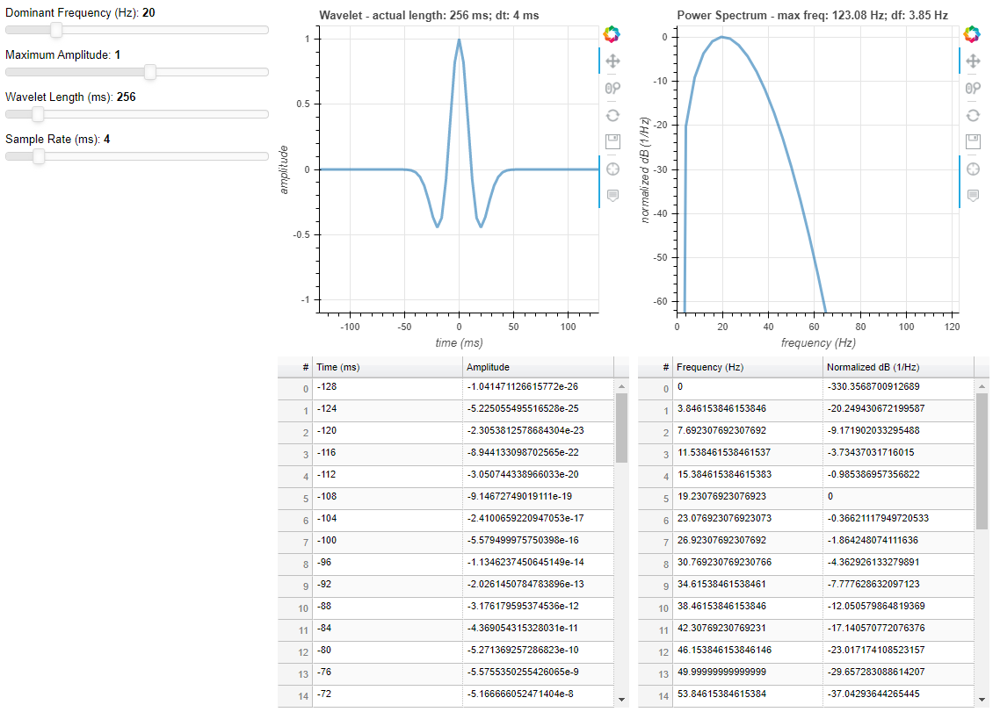

# ricker-heroku
Simple bokeh widget for heroku that enables dynamic creation of Ricker wavelet and its power spectrum, where the dominant frequency, maximum amplitude, wavelet length, and sample rate can be adjusted. Results are displayed both visually and tabularly to show both the binning and values in time and frequency domains.

The Ricker wavelet given here is one that is noncausal and symmetric around t=0 - i.e., zero-phased, and often of practical use in the modelling and calibration of seismic with well data. To preserve symmetry, the length of the wavelet is always an odd number of elements. A future version may allow for one to also interactively modify its phase and see its phase spectrum. 

As the Ricker's transform to the frequency domain is Hermitian, this is a one-sided power spectrum where the second half of the spectrum (the negative frequencies) has been thrown away, and all values in first half - apart from the mean - are doubled. The Fourier transform uses the convention such that the conservation of energy is conversed (i.e., Plancheral's theorem, Parserval's theorem). The power spectrum itself is given as normalized power dB (1/Hz).

https://ricker.herokuapp.com/myapp

